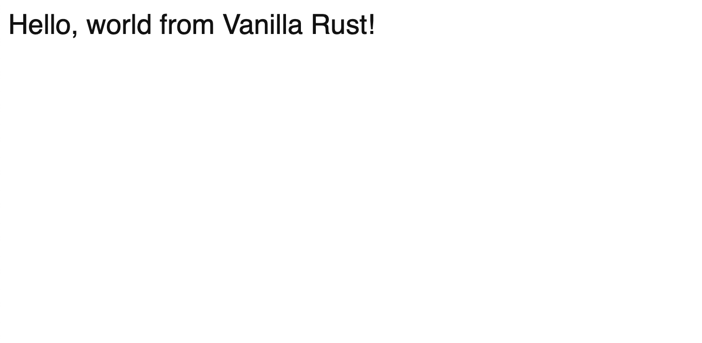

Trunk | Vanilla | web-sys
=========================
An example application demonstrating building a vanilla Rust (no frameworks) WASM web application using web-sys.

Once you've installed Trunk, simply execute `trunk serve --open` from this example's directory, and you should see the web application rendered in your browser.




## Note

Works only installing last **trunk** release running command below. Refers to [issue 415](https://github.com/thedodd/trunk/issues/415)
```
cargo install trunk --force --git https://github.com/thedodd/trunk.git --branch master
```